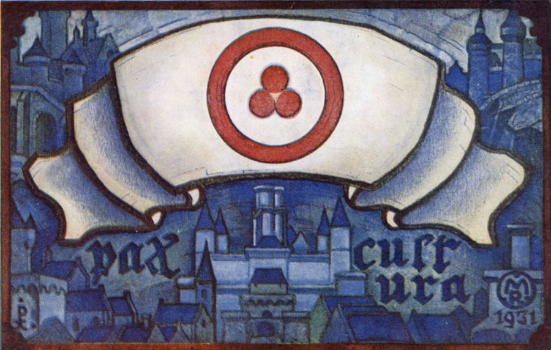

# Inner space exploration institute

Основные задачи института:

* синтез нового гуманитарного знания
* донесение и перестройка культурного кода через произведения искусства
* сохранение культурного наследия человечества (Pax culture)

**[Поиск по сайту](/search/)** — по всем разделам сразу.

---

* [Art](/art)
* [Natyashastra](/dance)
  * [Natya talam](/nt)
* [КШ](/ksh)
* [Theatre](/theatre)
* [Yoga](/yoga)
* [Hoop](/hoop)
* [Books](/books)
* [Ship](/ship)
